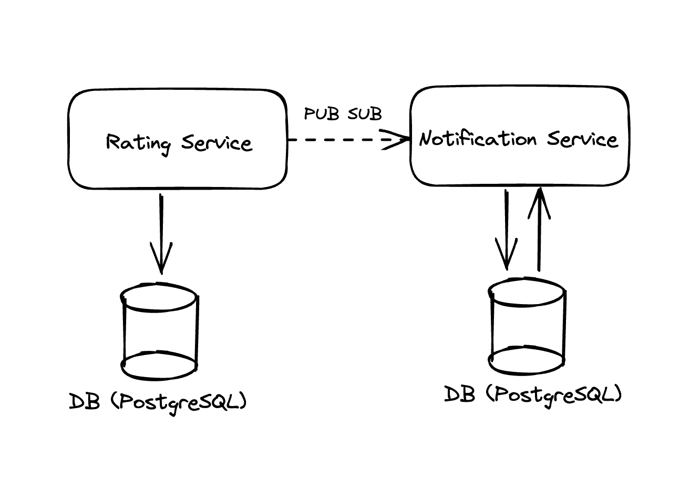

# Service Provider Ratings and Notifications

In this case study, I have created 2 APIs which are:

- Armut Rating API
- Armut Notification API

Each projects documentation could be found in their directories.

## Service Architecture
Service architecture could be found below:

*Service architecture diagram*

There are 2 microservices that has their own databases and these services are communicating each other through a Google Cloud Pub/Sub topic.

## Improvements that could be added

- A log tracking mechanism like Sentry.io or DataDog could be added to trace the logs more efficiently.
- To make it more scalable, we could use these applications in cloud.
- To make sure that every event has been sent, we could apply outbox pattern.
- CI/CD workflows could be added.

#### Author: İlker Rişvan

#### Github: ilkerrisvan

#### Email: ilkerrisvan@outlook.com

#### Date: April, 2023

### License

[MIT](https://choosealicense.com/licenses/mit/)